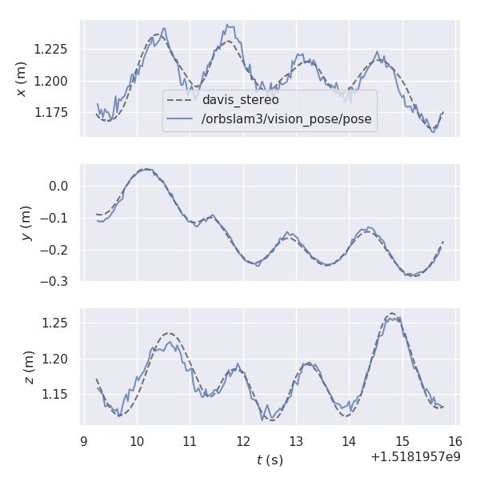
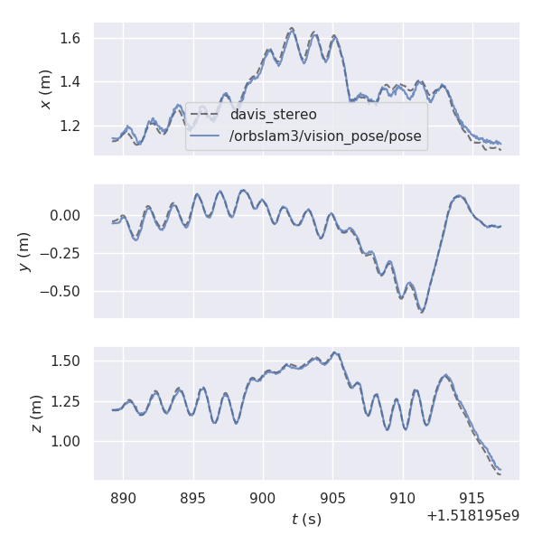
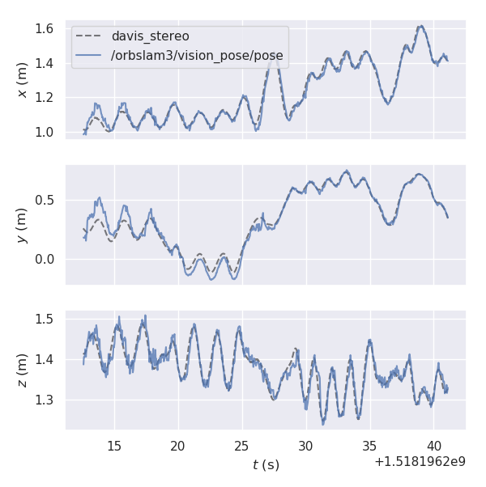
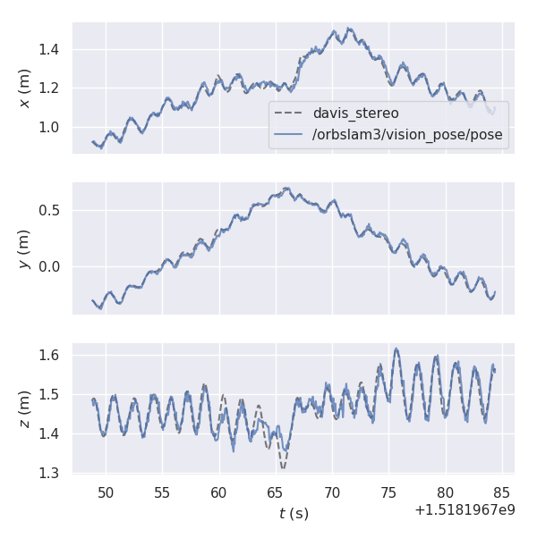

# Research on Event Accumulator Settings for Event-Based SLAM

This is the source code for paper "Research on Event Accumulator Settings for Event-Based SLAM". For more details, please see the paper

K. Xiao, G. Wang, Y. Chen, Y. Xie, H. Li and S. Li, "Research on Event Accumulator Settings for Event-Based SLAM," 2022 6th International Conference on Robotics, Control and Automation (ICRCA), 2022, pp. 50-56, doi: 10.1109/ICRCA55033.2022.9828933.

ArXiv preprint **[ arXiv:2112.00427](https://arxiv.org/abs/2112.00427)**(2022)

## 1. Prerequisites
See [dv_ros](https://github.com/kehanXue/dv_ros) 
 and [VINS-Fusion](https://github.com/HKUST-Aerial-Robotics/VINS-Fusion)

## 2. Build
```
cd ~/catkin_ws/src
git clone https://github.com/robin-shaun/event-slam-accumulator-settings.git
cd ../
catkin_make # or catkin build
source ~/catkin_ws/devel/setup.bash
```
## 3. Demo

We evaluate the proposed method quantitatively on the [Event Camera Dataset](http://rpg.ifi.uzh.ch/davis_data.html). This demo takes the [dynamic_6dof](http://rpg.ifi.uzh.ch/datasets/davis/dynamic_6dof.bag) sequence as example.

First, start dv_ros. Notice that the event accumulator depends on the timestamp, so when you restart the dataset or davis driver, you should restart dv_ros. 
```
roslaunch dv_ros davis240.launch
```

And then, start VINS-Fusion
``` bash
roslaunch vins vins_rviz.launch
```
``` bash
rosrun vins vins_node ~/catkin_ws/src/VINS-Fusion/config/davis/rpg_240_mono_imu_config.yaml

```

Finally, play the rosbag

``` bash
cd ~/catkin_ws/src/event-slam-accumulator-settings/dataset
rosbag play dynamic_6dof.bag
```

Notice that the default frequency of VINS-Fusion is the same as the event frame frequency, 30 Hz. If your CPU is not strong enough, maybe you should decrease it to 15 Hz in this [file](VINS-Fusion/vins_estimator/src/estimator/estimator.cpp) by uncommenting the code. However, this will decrease the performance as well.

``` cpp
        // if(inputImageCnt % 2 == 0)
        // {
            mBuf.lock();
            featureBuf.push(make_pair(t, featureFrame));
            mBuf.unlock();
        // }
```


## 4. Run with your devices

We have tested the code with DAVIS240 and DAVIS346. If you want to run with your devices, you should use [rpg_dvs_ros](https://github.com/ethz-asl/kalibr). The most important thing to do is calibrating the event camera and imu. We advise to use [Kalibr](https://github.com/ethz-asl/kalibr) with traditional image from APS and IMU, because the intrinsics and extrinsics are almost the same for APS and DVS.

If you want to compare the event-based VINS Fusion with traditional VINS Fusion with DAVIS346, you should use this code. Because the frame from APS of DAVIS346 sometimes changes the size, we do some modification for VINS-Fusion.  

## 5. Run with ORBSLAM3 for Stereo Visual SLAM

Event frame based stereo visual SLAM is not introduced in the paper. We use [ORBSLAM3](https://github.com/UZ-SLAMLab/ORB_SLAM3) to process the event frames from dv_ros. The dataset is [stereo DAVIS dataset](https://rpg.ifi.uzh.ch/ECCV18_stereo_davis.html).The result shows that the proposed method performs better than [ESVO](https://github.com/HKUST-Aerial-Robotics/ESVO) by computing absolute trajectory error (RMS, unit: cm), using [Python package for the evaluation of odometry and SLAM](https://github.com/MichaelGrupp/evo). 

| Sequence | Proposed | ESVO |
| :------: | :------: | :--: |
| monitor  |   1.49   | 3.3  |
|   bin    |   2.66   | 2.8  |
|   box    |   3.51   | 5.8  |
|   desk   |   3.14   | 3.2  |

Event window size: 15000, Event contribution: 0.33

monitor



bin



box



desk



First compile ORBSLAM3 with ROS according to [this](ORB_SLAM3/README.md). And then you can use this [script](ORB_SLAM3/davis240_run_orbslam_stereo.sh) to run ORBSLAM3, which subscribes event frames and publish estimated poses (We modify ORBSLAM3 a little to publish estimated poses).


## 6. Evalute results

We modify [rpg_trajectory_evaluation](https://github.com/uzh-rpg/rpg_trajectory_evaluation) to print mean position error and mean yaw error in the terminal. You can evalute results showed in the paper by

```
python analyze_trajectory_single.py ../results/boxes_6dof
```

## 7. Acknowledgements

Thanks for [dv_ros](https://github.com/kehanXue/dv_ros) and all the open source projects we use.

